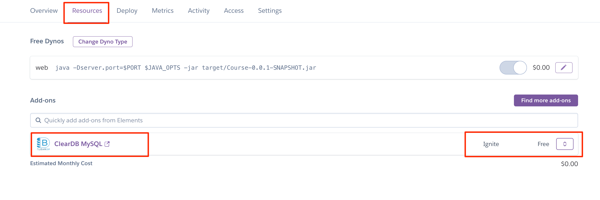

## Hướng dẫn đẩy ứng dụng SpringBoot lên trên Heroku

##### Tạo tài khoản heroku và đăng nhập

Truy cập vào trang web heroku.com, tiến hành đăng ký tài khoản và đăng nhập

#### Tạo heroku-app

**1. Tạo app trên heroku**


Hoặc sử dụng teminal (đã cài heroku CLI)

```bash
$ heroku create springboot-course-app
```

**2. Tạo database**

Yêu cầu đăng ký thẻ visa trên heroku (free)

Vào phần https://dashboard.heroku.com/account/billing để đăng ký thẻ visa

Sau đó tìm kiếm Add-ons là : **ClearDB MySQL** và thêm vào



**3. Đẩy code lên trên heroku**

Nếu trong project của bạn đang sử dụng java 17 thì hãy bổ sung thêm file **system.properies** với nội dung

```
java.runtime.version=17
```

Trong thư mục chứa project, bật terminal và thực hiện các câu lệnh sau


```bash
1. Login to heroku

$ heroku login

2. Tạo commit và đẩy code lên

$ git init
$ git status
$ git add .
$ git commit -m "update"
$ git push heroku main
```

**4. Restore database**

Sử dụng **phpMyAdmin** để tạo bản backup cho database, và có thể lưu vào thư mục chưa project để tiện cho việc copy vào container


**Kết nối với database trong heroku**

1. Kiểm tra id của container đang chạy

```
$ docker ps
```

2. Exec vào trong container mysql đang chạy

```
$ docker exec -it [container_id] /bin/sh
```

3. Kiểm tra tham số của database

```
$ mysql -u [name] -p[password] -h [host]
```

> Trong đó những tham số name, password, host lấy thông số của app

Connect to database

```
$ show databases

$ connect to [database_name]

$ select @@character_set_database, @@collation_data_base

$ exit
```

**4. Sửa bản backup**

Trong bản backup database, sửa các thông số cho giống với thông số trong container

**5. Copy file backup vào trong container**

Ví dụ tạo folder database và cho file backup vào trong đó

```bash
$ mkdir database

$ docker cp ./[file_backup.sql] [container_id]:/database
```

**6. Restore database**

Xóa database đang có

```bash
$ mysql -u [name] -p[password] -h [host]

$ drop database [database_name]

$ exit
```

Restore database

```
$ mysql -u [name] -p[password] -h [host] < database/[file_backup.sql]
```